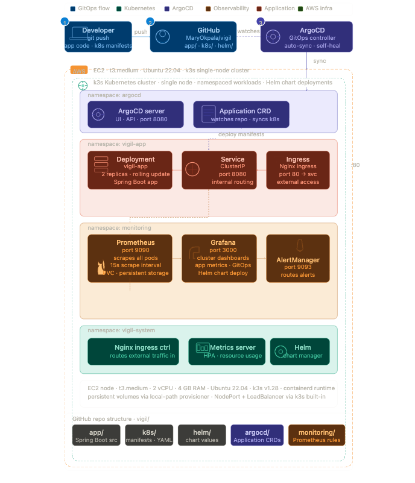
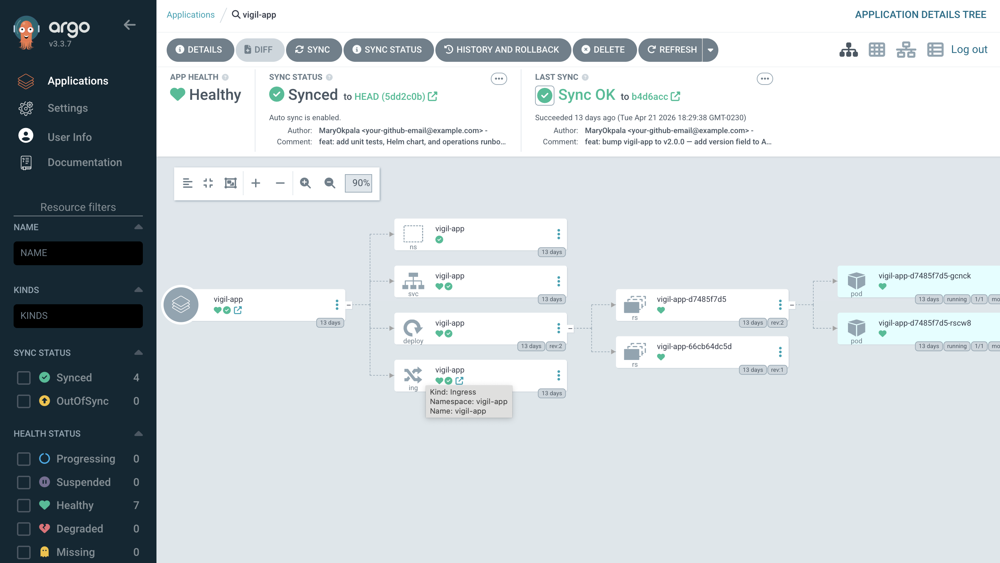
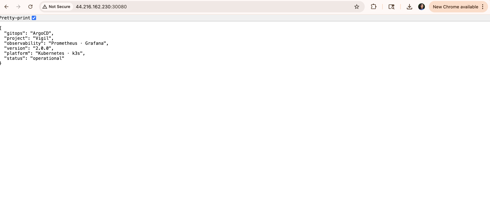
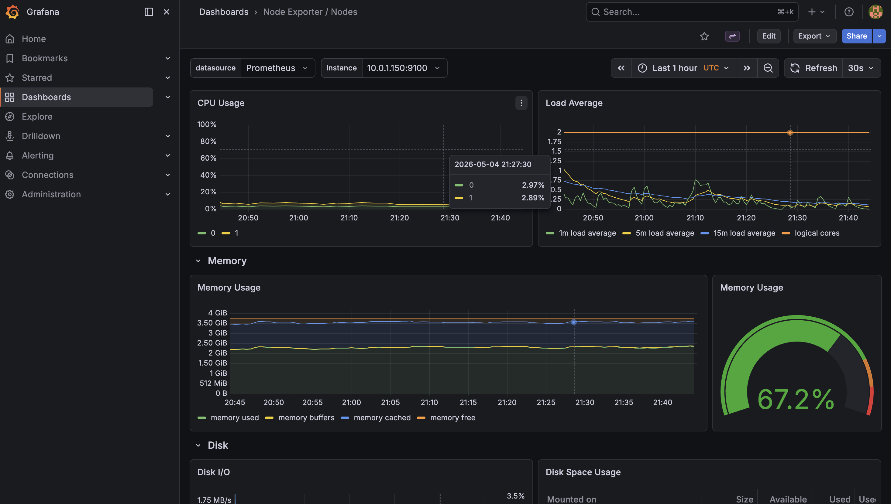

# Vigil

> A cloud-native GitOps platform where every Git commit triggers an automatic deployment to Kubernetes — no manual commands, no scripts, no human in the loop.

---
Vigil makes deployments automatic, observable, and self-healing. Push a commit. ArgoCD detects it within minutes. The cluster updates itself with a zero-downtime rolling deployment. Prometheus captures every metric from every pod. Grafana shows you exactly what is happening in real time. If something goes wrong, AlertManager fires before a user notices.

---

## Architecture



---

## The GitOps loop

This is how Vigil deploys software:

1. I push a commit to `github.com/MaryOkpala/vigil`
2. ArgoCD detects the change within 3 minutes by watching the repository
3. ArgoCD compares the desired state in Git with the actual state in the cluster
4. ArgoCD applies the diff — a rolling update with zero downtime
5. Kubernetes creates new pods before terminating old ones — traffic never drops
6. Prometheus scrapes metrics from the new pods immediately
7. Grafana dashboards update in real time

At no point did I run `kubectl apply`. At no point did I SSH into the server. The cluster managed itself.

---

## The resource graph — everything healthy

When you look at the ArgoCD resource graph for Vigil, you are seeing the complete picture of what is running in the cluster and the relationship between every component.



What this shows:

**App health: Healthy.** Every resource in the cluster is operating correctly.

**Sync status: Synced to HEAD.** The cluster state exactly matches what is in the GitHub repository. There is no drift.

**Auto sync is enabled.** The next commit I push will trigger another deployment automatically.

**The resource tree** shows the full Kubernetes hierarchy — the vigil-app Application manages a Namespace, a Service, a Deployment, and an Ingress. The Deployment manages two ReplicaSets — the current one (`d7485f7d5`) at revision 2 running two pods, and the previous one (`66cb64dc5d`) at revision 1 retained for rollback history.

---

## The rolling update — watching it happen

When I bumped the application from v1.0.0 to v2.0.0, I changed one line of code, built a new Docker image, updated the image tag in the Kubernetes manifest, and pushed to GitHub.

ArgoCD detected the change. Kubernetes started the rolling update. One new pod started. Once it passed its readiness probe, one old pod terminated. Then the second new pod started. Once it passed, the second old pod terminated.

At no point were there fewer than two healthy pods serving traffic. Zero downtime. The entire update was driven by a Git commit.

The proof is in the resource graph — two ReplicaSets exist simultaneously during the transition. The old one scales down. The new one scales up. Kubernetes handles the orchestration.

---

## The application is live

At the end of every successful GitOps sync, the application is running and responding.



```json
{
  "gitops": "ArgoCD",
  "project": "Vigil",
  "observability": "Prometheus · Grafana",
  "version": "2.0.0",
  "platform": "Kubernetes · k3s",
  "status": "operational"
}
```

Version 2.0.0. The `version` field was added in the second deployment — the one that triggered the rolling update you can see in the resource graph. That field exists in the response because ArgoCD deployed it automatically when I pushed the commit.

---

## Full observability — the cluster under the microscope

Deploying software is only half the job. The other half is knowing what it is doing once it is running.



What this dashboard shows in real time:

**CPU usage** is running at approximately 3% across both cores — the cluster is healthy and not under stress.

**Memory usage** is at 67.2% — the workloads are running comfortably within the available RAM.

**Load average** shows the cluster is operating well within capacity.

**Disk I/O** confirms storage is healthy.

This dashboard is driven by Prometheus scraping metrics from the Node Exporter running on the cluster. It updates every 30 seconds. There is no manual query needed. The data is always there.

---

## Stack

| Layer | Tool |
|-------|------|
| Kubernetes | k3s v1.34 |
| GitOps | ArgoCD v3.3 |
| Package management | Helm |
| Ingress | Nginx Ingress Controller |
| Metrics collection | Prometheus · kube-prometheus-stack |
| Observability | Grafana · AlertManager |
| Application | Spring Boot · Java 17 |
| Container registry | Docker Hub |
| Infrastructure | AWS EC2 · Ubuntu 22.04 |

---

## Repository structure

```
vigil/
├── app/                        # Spring Boot application source
│   ├── src/
│   ├── Dockerfile
│   └── pom.xml
├── k8s/                        # Kubernetes manifests — ArgoCD syncs this
│   ├── namespace.yaml
│   ├── deployment.yaml
│   ├── service.yaml
│   └── ingress.yaml
├── argocd/
│   └── vigil-app.yaml          # ArgoCD Application resource
├── helm/vigil-app/             # Helm chart for the application
├── monitoring/
│   ├── vigil-servicemonitor.yaml
│   └── vigil-alerts.yaml
└── docs/
```

---

## Running it yourself

### Prerequisites

- AWS EC2 instance (t3.medium or larger)
- k3s installed
- Helm installed

### Install ArgoCD

```bash
helm repo add argo https://argoproj.github.io/argo-helm
helm install argocd argo/argo-cd --namespace argocd --create-namespace
kubectl apply -f argocd/vigil-app.yaml
```

### Install observability stack

```bash
helm repo add prometheus-community https://prometheus-community.github.io/helm-charts
helm install prometheus prometheus-community/kube-prometheus-stack \
  --namespace monitoring --create-namespace
kubectl apply -f monitoring/
```

### Trigger a GitOps deployment

```bash
# Simply push to main — ArgoCD handles the rest
git push origin main
```

---

## What this project demonstrates

The pattern — Git as the source of truth, automatic reconciliation, zero-downtime deployments, full observability — is the same pattern used by engineering teams running Kubernetes in production at scale.

---

*Built by [Mary Okpala](https://linkedin.com/in/mary-okpalaa) · [github.com/MaryOkpala](https://github.com/MaryOkpala)*
